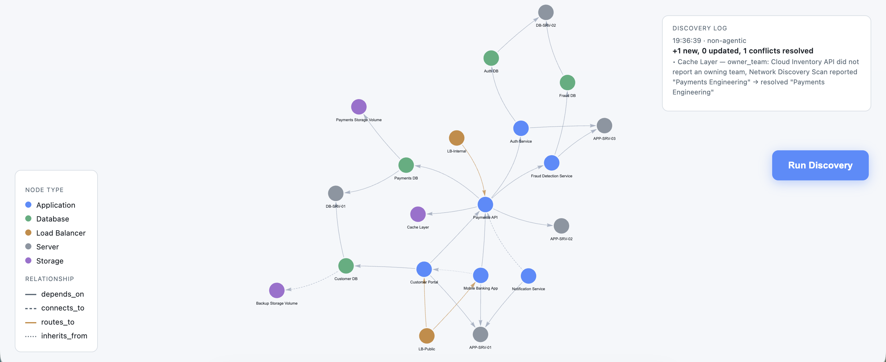

# Acme Bank: Living Infrastructure Graph


A live, physics-based visualization of a fictional bank's IT infrastructure, modeling the same discovery, CMDB, and dependency-mapping problem that real IT Operations Management (ITOM) platforms solve for enterprises.

**Live demo → [acme-bank-living-graph.netlify.app](https://acme-bank-living-graph.netlify.app)**



## What it does

- **Renders a real infrastructure topology as a living graph.** Servers, applications, databases, load balancers, and storage volumes drift and settle with physics, the way [Obsidian's graph view](https://obsidian.md/) does, rather than sitting in a static diagram.
- **Runs real discovery cycles, not a scripted demo.** Each click of *Run Discovery* simulates independent sources reporting on infrastructure, some of it new, some of it a re-check of what's already known, generated fresh every time.
- **Reconciles conflicting reports two different ways, side by side.** A deterministic engine (fixed rules: most-recent-observation-wins, fill-the-gap) and an agentic engine (an LLM reasons about which source to trust and explains why) log their results to the same panel, so the two approaches are directly comparable.
- **Blast-radius highlighting.** Click any node to see everything that depends on it, directly or transitively, light up in red, while everything unrelated dims. Click empty space to reset.
- **A permanent discovery log**, not a toast notification. Every run, its counts, and its full reasoning are written to the graph database itself and persist across reloads.
- Light/dark theme, split-screen layout (graph left, controls and log right).

See [`concepts.md`](concepts.md) for plain-language explanations of the ideas behind this (CMDBs, discovery, agentic vs. deterministic reasoning, and more).

## Why this exists

Most CMDBs are just tables. The relationships between infrastructure, what depends on what, matter as much as the inventory itself, and are what make questions like *"what breaks if this database goes down"* answerable at all. This project treats that relationship data as a real graph, queried with [Cypher](https://neo4j.com/docs/getting-started/cypher-intro/), instead of flattening it into rows.

## Stack

| Layer | Tool |
|---|---|
| Graph database | [Neo4j AuraDB](https://neo4j.com/product/auradb/) |
| Rendering | [vis-network](https://visjs.github.io/vis-network/docs/network/) |
| Backend | [Netlify Functions](https://docs.netlify.com/functions/overview/) (serverless) |
| Agentic reasoning | [DeepSeek API](https://platform.deepseek.com/) |
| Hosting / CI | [Netlify](https://www.netlify.com/), continuous deployment from this repo |

## Data model

**Node types:** `Application`, `Database`, `LoadBalancer`, `Server`, `Storage`
**Relationship types:** `depends_on`, `connects_to`, `routes_to`, `inherits_from`

## Project structure

```
index.html                              the entire frontend
netlify/functions/graph-data.mts        returns the current graph as JSON
netlify/functions/run-discovery.mts     deterministic multi-source discovery engine
netlify/functions/run-discovery-agentic.mts   agentic discovery engine (DeepSeek)
netlify/functions/discovery-log.mts     returns recent discovery runs
concepts.md                             plain-language explanations of the ideas used here
```
